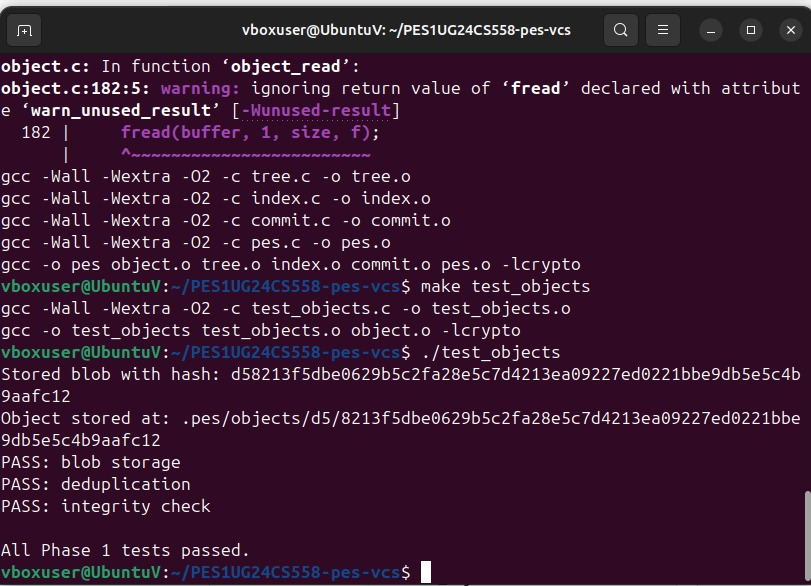
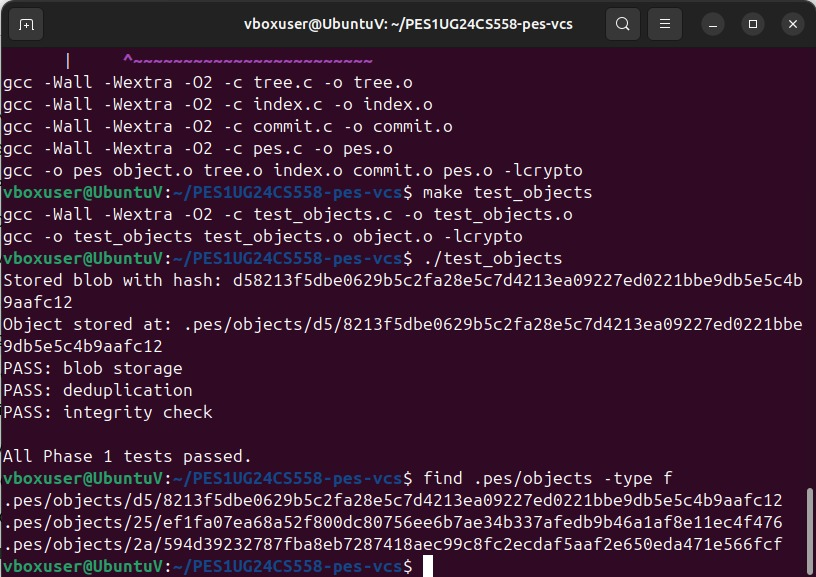

# Lab Report: Building PES-VCS

## Student Credentials
- **Student Name:** Arati  
- **SRN:** PES1UG24CS558  
- **Course:** Computer Science (Engineering)  
- **Platform:** Ubuntu 22.04 (VirtualBox)

---
# 1. Project Overview

The objective of this lab was to build a simplified Version Control System (VCS) called **PES-VCS**, inspired by Git’s internal architecture.  

The system implements:
- Content-addressable storage using SHA-256
- Directory tree structure for file organization
- A staging area (index) for tracking changes
- Commit history management for version tracking

- # 2. Implementation Details

## 🔹 Phase 1: Object Storage (object.c)

Implemented:
- `object_write()`
- `object_read()`

Objects are stored by:
- Adding header (`type size\0`)
- Computing SHA-256 hash
- Storing in `.pes/objects/XX/YY...` (sharded format)
- 
- 
- 
