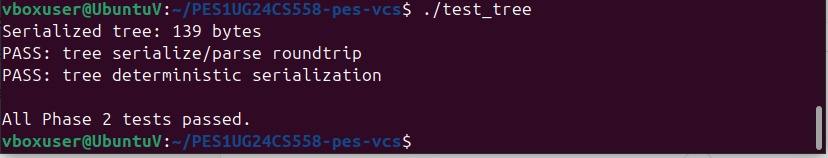
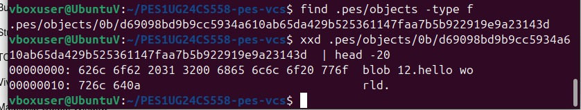
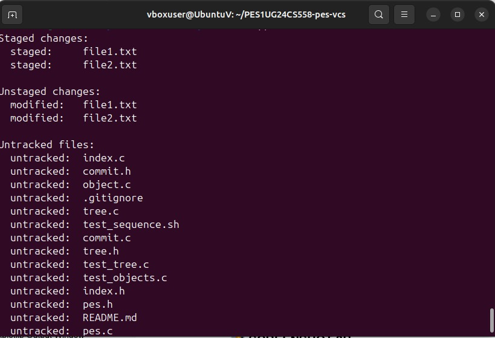
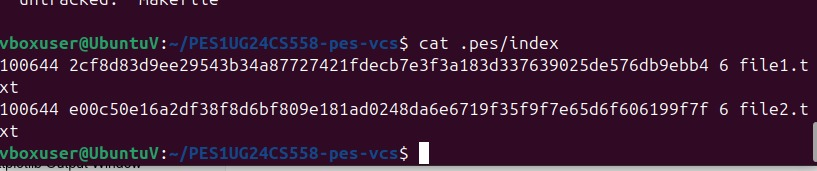
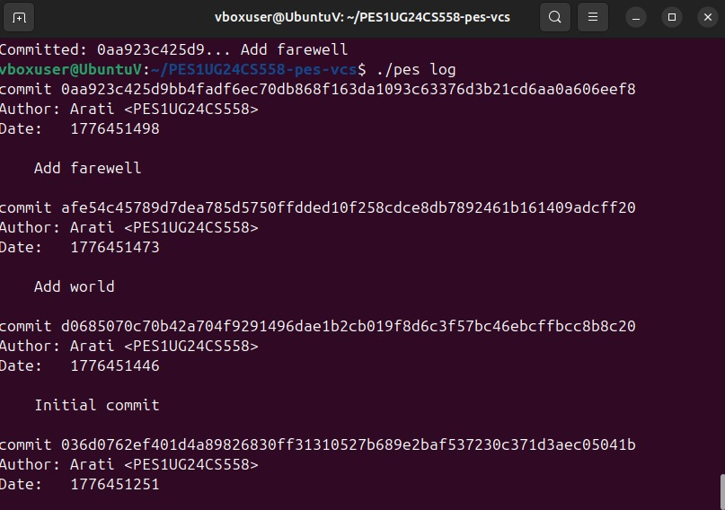
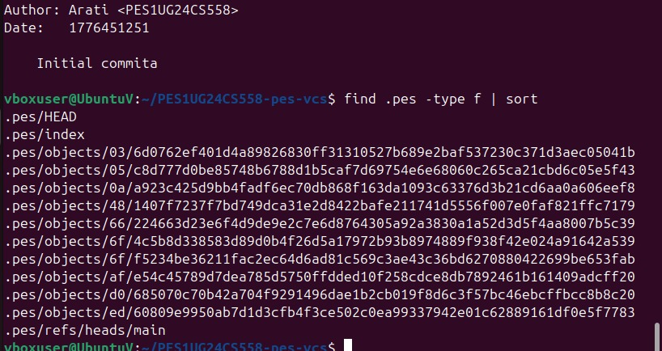
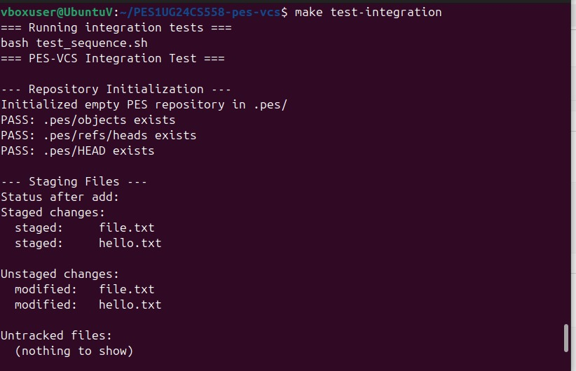
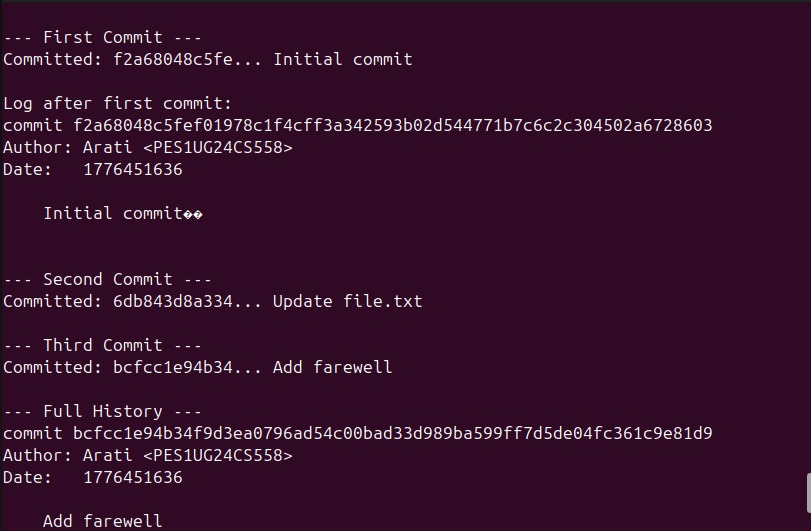
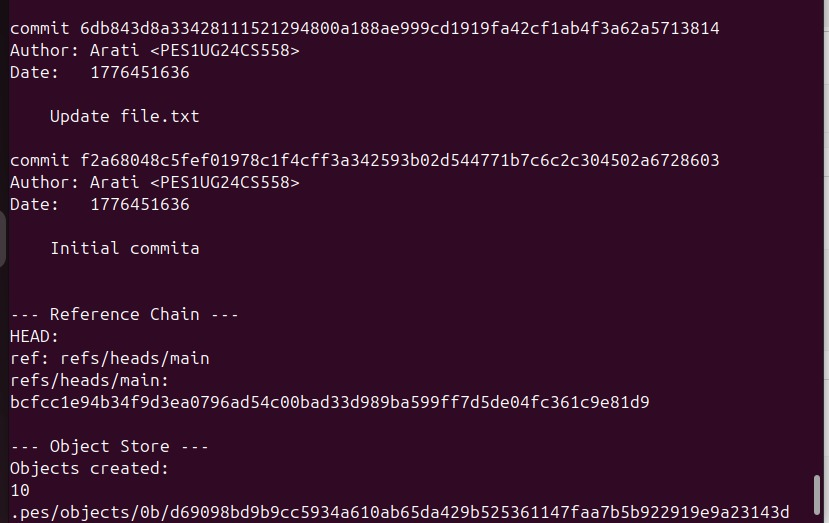
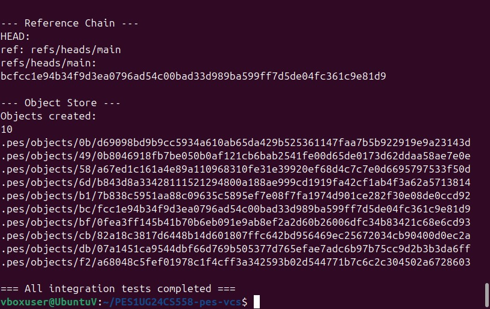

# Lab Report: Building PES-VCS

## Student Credentials
- **Student Name:** Arati  
- **SRN:** PES1UG24CS558  
- **Course:** Computer Science (Engineering)  
- **Platform:** Ubuntu 22.04 (VirtualBox)

---
# 1. Project Overview

The objective of this lab was to build a simplified Version Control System (VCS) called **PES-VCS**, inspired by Git’s internal architecture.  

The system implements:
- Content-addressable storage using SHA-256
- Directory tree structure for file organization
- A staging area (index) for tracking changes
- Commit history management for version tracking

- # 2. Implementation Details

## 🔹 Phase 1: Object Storage (object.c)

Implemented:
- `object_write()`
- `object_read()`

Objects are stored by:
- Adding header (`type size\0`)
- Computing SHA-256 hash
- Storing in `.pes/objects/XX/YY...` (sharded format)
- 
- 

- **Verification:**
- Blob storage working correctly  
- Deduplication verified  
- Integrity checks passed
- ---

## 🔹 Phase 2: Tree Objects (tree.c)

Implemented:
- `tree_from_index()`

Functionality:
- Converts index entries into tree objects  
- Maintains directory hierarchy  
- Stores file metadata (mode, hash)
- 
- 

- **Verification:**
- Tree serialization correct  
- Deterministic structure achieved
- --- 
## 🔹 Phase 3: Staging Area (index.c)

Implemented:
- `index_load()`
- `index_save()`
- `index_add()`

Function:
- Tracks staged files  
- Stores metadata (size, path, hash)
- Commands:
- `./pes add <file>`
- `./pes status`
- 
- 
- ---

## 🔹 Phase 4: Commits & History (commit.c)

Implemented:
- `commit_create()`

Functionality:
- Creates snapshot of index as tree  
- Links with parent commit  
- Stores author (Arati <PES1UG24CS558>)  
- Updates HEAD reference
-  
-   
---
## 🔹 Final Integration Test





---

## 🔹 Phase 5: Branching and Checkout
### Q5.1
A branch is stored as a file containing a commit hash.  
To implement checkout:
- Update `.pes/HEAD`
- Load commit from target branch
- Restore working directory using tree  
Complexity arises from handling file overwrites and consistency.

---

### Q5.2
Dirty working directory is detected by:
- Comparing working directory files with index  
- Comparing index with target branch  
If mismatch exists → conflict → checkout denied  

---

### Q5.3
Detached HEAD:
- HEAD points directly to commit  
- New commits are not linked to branch  
Recovery:
- Create new branch using commit hash  

---

## 🔹 Phase 6: Garbage Collection
### Q6.1
Use **Mark and Sweep algorithm**:
- Start from branch heads  
- Mark reachable objects  
- Delete unreachable ones  

Use **Hash Set** for tracking  

---

### Q6.2
Concurrent GC is dangerous because:
- GC may delete objects before commit finishes  
- Causes broken references  

Git avoids this using:
- Safe writes  
- Locking mechanisms  

---
# 4. Conclusion

This project provided deep understanding of:
- Object storage  
- Tree structures  
- Version tracking  
- Git internals  
---
# 5. Build and Run Instructions

## Compilation
```bash
make

## Usage:

```bash
./pes init
./pes add <file>
./pes commit -m "message"
./pes status
./pes log


